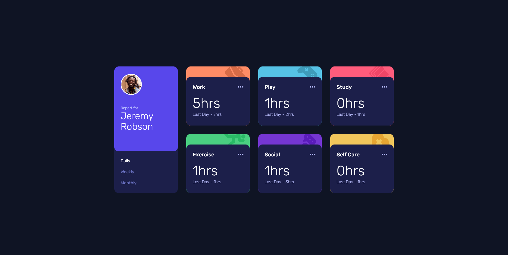
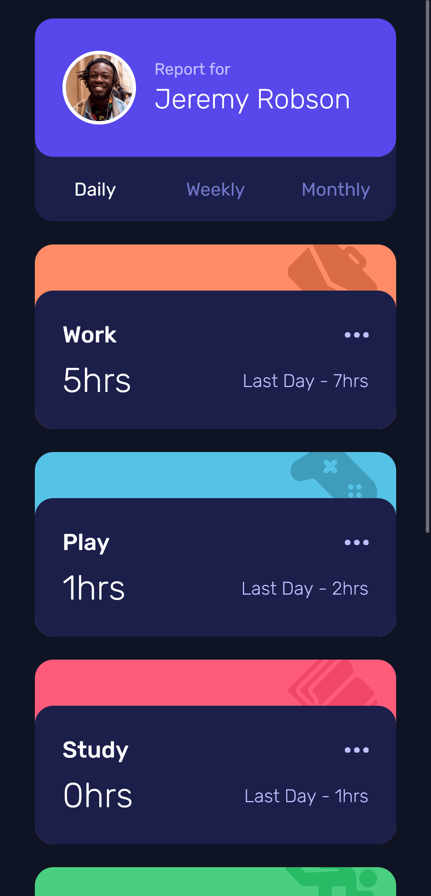

# Frontend Mentor - Time Tracking Dashboard

This is a solution to the [Frontend Mentor Challenge - Time Tracking Dashboard](https://www.frontendmentor.io/challenges/time-tracking-dashboard-UIQ7167Jw). The goal of the challenge is to build a responsive dashboard that displays time-tracking data for daily, weekly, and monthly views.

## 🔗 Live Site

Check out the live project here:  
👉 [ariarzg-time-tracking-dashboard.netlify.app](https://ariarzg-time-tracking-dashboard.netlify.app/)

## 🖼️ Screenshots

### 💻 Desktop View



### 📱 Mobile View



## 🛠️ Technologies Used

- **Vite**
- **HTML**
- **CSS**
- **JavaScript**
- **Tailwind CSS**

## 📱 Responsive Design

The project is fully responsive, adapting beautifully to:

- **Mobile devices**
- **Tablets**
- **Desktops**

Layout is handled using **CSS Grid**, providing a clean and organized structure across all screen sizes.

## ✨ Features

- Smooth, responsive layout with **multiple breakpoints**
- **Beautiful hover effects** for buttons and cards
- **Dynamic content switching**: using JavaScript, users can view their activity data filtered by **daily**, **weekly**, or **monthly** reports

## 📁 Project Setup

If you'd like to run this project locally:

```bash
git clone https://github.com/Ariarzg/03-time-tracking-dashboard.git
cd time-tracking-dashboard
npm install
npm run dev
```

## 🎯 What I Learned

Through this challenge, I practiced:

- Advanced layout techniques using **CSS Grid**
- Utility-first styling with **Tailwind CSS**
- Creating responsive and interactive UIs
- Using JavaScript to update UI content dynamically based on user input
- Efficient development workflow with **Vite**

## 📄 License

This project is for educational purposes and part of a challenge by [Frontend Mentor](https://www.frontendmentor.io/).

---

Feel free to reach out if you have feedback or questions!
